WHAT MAKES A CEREAL HEALTHY? A RECOMMENDATION
---------------------------------------------

I am using the USDA, FDA, and other reputable sources to determine the
attributes of a healthy cereal.I will state my assumptions of what is
considered healthy below and will be using those as a guide for
determining the types of clusters and to assist my recommendations.

**HEALTHY GUIDELINES**

-   **Sugar content:** .25g of sugar for every 4g of cereal.
    -   (**Reference**:
        <a href="https://www.fns.usda.gov/tn/choose-breakfast-cereals-are-lower-sugar" class="uri">https://www.fns.usda.gov/tn/choose-breakfast-cereals-are-lower-sugar</a>)
-   **Fiber at least 3 grams per serving**
    -   (**Reference**:
        <a href="https://foodcorps.org/cms/assets/uploads/2018/01/Healthy-School-Program-Resource-Guide-1-11.pdf" class="uri">https://foodcorps.org/cms/assets/uploads/2018/01/Healthy-School-Program-Resource-Guide-1-11.pdf</a>)
-   **Sodium content:**
    -   Low sodium: 5% or less per serving size
    -   High sodium: 20% or more per serving size
    -   (**Reference**:
        <a href="https://www.fda.gov/food/nutrition-education-resources-materials/sodium-your-diet" class="uri">https://www.fda.gov/food/nutrition-education-resources-materials/sodium-your-diet</a>)

**NOTE** I do not include fat content because fat can be healthy
depending on the type which isn’t stated in the dataset. Also, vitamins
are not broken into types in this dataset so it is difficult to use that
as an indicator since many cereals add vitamins.

    library(tidyverse)
    library(caret)
    library(factoextra)
    library(cluster)
    library(fpc)
    library(fastDummies)
    set.seed(15)

    # Changed the column types to better represent the types in the columns.
    cereal <- read_csv("Cereals.csv",
                       col_types = c("cffiiiiddiiifddd"))

    ##       name        mfr       type   calories    protein        fat     sodium
    ## 0.00000000 0.00000000 0.00000000 0.00000000 0.00000000 0.00000000 0.00000000
    ##      fiber      carbo     sugars     potass   vitamins      shelf     weight
    ## 0.00000000 0.01298701 0.01298701 0.02597403 0.00000000 0.00000000 0.00000000
    ##       cups     rating
    ## 0.00000000 0.00000000

Carbo, sugars, and potass are the only variables with missing values. It
makes the most sense to simply remove them since it will only be about 3
cereals (rows). Also, I noticed that the data for weight measurement is
mixed using imperial and metric based measurements (cups/lbs/ounces
vs. grams). Going to convert the weight measurement to grams as well as
the cups column. Using 201.6g per cup and 453.6g per lbs (it seems that
the weight column is in lbs. source:
<a href="https://www.metric-conversions.org/weight/ounces-to-grams.htm" class="uri">https://www.metric-conversions.org/weight/ounces-to-grams.htm</a>).
Normalizing will remove these measurements but I will need to compare
clusters later, pre-normalization, so this conversion will help me
later. Also, the USDA has different levels for healthy amounts of sugars
depending on the serving size in grams.

    # Converted cups/lbs/ounces to grams.
    cereal %>%
      mutate(cups = cups * 201.6,
             weight = weight * 453.6) %>%
      rename(serving_size = cups) -> cereal

Normalizing Dataset
-------------------

    # Normalized the dataset before removing any data so I can include as much data as possible to get closer to the true mean and variance in the dataset.
    norm <- preProcess(cereal,
                       method = c("scale", "center"))

    # Normalizing the entire dataset (before cleaning it) due to the magnitudes and measurements being different (calories, rating, grams, etc...). I want to remove those so that certain variables do not show as being weighted more
    cereal_norm <- predict(norm, cereal)

    summary(cereal_norm)

    ##      name           mfr    type      calories          protein       
    ##  Length:77          N: 6   C:74   Min.   :-2.9195   Min.   :-1.4116  
    ##  Class :character   Q: 8   H: 3   1st Qu.:-0.3533   1st Qu.:-0.4982  
    ##  Mode  :character   K:23          Median : 0.1600   Median : 0.4152  
    ##                     R: 8          Mean   : 0.0000   Mean   : 0.0000  
    ##                     G:22          3rd Qu.: 0.1600   3rd Qu.: 0.4152  
    ##                     P: 9          Max.   : 2.7262   Max.   : 3.1554  
    ##                     A: 1                                             
    ##       fat              sodium            fiber              carbo         
    ##  Min.   :-1.0065   Min.   :-1.9047   Min.   :-0.90290   Min.   :-2.50878  
    ##  1st Qu.:-1.0065   1st Qu.:-0.3540   1st Qu.:-0.48333   1st Qu.:-0.71728  
    ##  Median :-0.0129   Median : 0.2424   Median :-0.06375   Median :-0.07745  
    ##  Mean   : 0.0000   Mean   : 0.0000   Mean   : 0.00000   Mean   : 0.00000  
    ##  3rd Qu.: 0.9807   3rd Qu.: 0.6003   3rd Qu.: 0.35582   3rd Qu.: 0.56237  
    ##  Max.   : 3.9614   Max.   : 1.9124   Max.   : 4.97115   Max.   : 2.09795  
    ##                                                         NA's   :1         
    ##      sugars             potass           vitamins       shelf
    ##  Min.   :-1.60467   Min.   :-1.1883   Min.   :-1.2643   3:36  
    ##  1st Qu.:-0.91953   1st Qu.:-0.7977   1st Qu.:-0.1453   1:20  
    ##  Median :-0.00601   Median :-0.1231   Median :-0.1453   2:21  
    ##  Mean   : 0.00000   Mean   : 0.0000   Mean   : 0.0000         
    ##  3rd Qu.: 0.90751   3rd Qu.: 0.3030   3rd Qu.:-0.1453         
    ##  Max.   : 1.82103   Max.   : 3.2855   Max.   : 3.2115         
    ##  NA's   :1          NA's   :2                                 
    ##      weight         serving_size         rating       
    ##  Min.   :-3.5195   Min.   :-2.4538   Min.   :-1.7529  
    ##  1st Qu.:-0.1968   1st Qu.:-0.6490   1st Qu.:-0.6757  
    ##  Median :-0.1968   Median :-0.3053   Median :-0.1613  
    ##  Mean   : 0.0000   Mean   : 0.0000   Mean   : 0.0000  
    ##  3rd Qu.:-0.1968   3rd Qu.: 0.7690   3rd Qu.: 0.5811  
    ##  Max.   : 3.1260   Max.   : 2.9176   Max.   : 3.6334  
    ##

One Hot Encoding Variables
--------------------------

    # One Hot Encoding "shelf" variable so I can include it in the euclidean meaurement for distance between points.
    cereal_norm <- dummy_cols(cereal_norm,
                         select_columns = c("shelf"),
                         remove_first_dummy = FALSE,
                         remove_selected_columns = TRUE)

Looking at the structure of each variable, most of them look to be
fairly normally distributed as the means are relatively close to the
medians. Some variables have a larger max value, but it is to be
expected since some cereals have more of a specific variable, like fiber
or vitamins.

    # I decided to remove the rows with missing values since it was only 3 cereals or less than 5% of the dataset.
    cereal_norm <- cereal_norm[complete.cases(cereal_norm), ]
    colMeans(is.na(cereal_norm))

    ##         name          mfr         type     calories      protein          fat
    ##            0            0            0            0            0            0
    ##       sodium        fiber        carbo       sugars       potass     vitamins
    ##            0            0            0            0            0            0
    ##       weight serving_size       rating      shelf_3      shelf_1      shelf_2
    ##            0            0            0            0            0            0

    #  I realized that the only hot cereal remaining in the dataset was "Maypo" after removing the rows with missing values. Removing "Maypo" would allow me to remove the column eliminating a variable. Also, after keeping Maypo in the dataset and comparing the dendrograms, for k > 1, they all kept "Maypo" in its own branch/leaf. For those reasons, I decided to remove the cereal and variable "type".

    cereal_norm <- cereal_norm[-42, -3]

Outliers are Informative in this Dataset
----------------------------------------

    boxplot(cereal_norm[, 3:17])

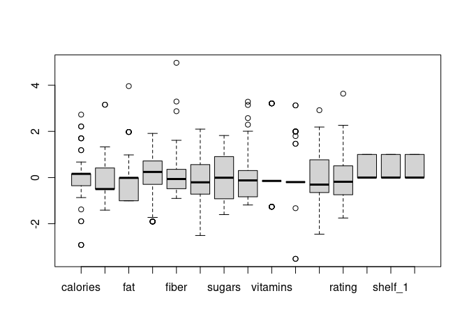

    cereal_norm %>%
      filter(calories> 1 & weight > 0) %>%
      select(name, sugars, shelf_3, rating)

    ## # A tibble: 6 x 4
    ##   name                        sugars shelf_3 rating
    ##   <chr>                        <dbl>   <int>  <dbl>
    ## 1 Basic_4                    0.222         1 -0.401
    ## 2 Just_Right_Fruit_&_Nut     0.451         1 -0.441
    ## 3 Mueslix_Crispy_Blend       1.36          1 -0.879
    ## 4 Nutri-Grain_Almond-Raisin -0.00601       1 -0.140
    ## 5 Oatmeal_Raisin_Crisp       0.679         1 -0.870
    ## 6 Total_Raisin_Bran          1.59          1 -1.00

After investigating the outliers in this datset, they will be
informative for clustering. For example, calories and weight outliers
are the same type of cereals. These cereals all appear on the same shelf
abnd have lower ratings in addition to having higher calories and weight
(see above). Surprisingly, many of them have higher sugar levels
compared to the other cereals, however, it could be due to the dried
fruits which adds to the heavier weight of the cereal as well.

Possible Relationships in the Dataset
-------------------------------------

    cor(cereal_norm[, 3:17]) -> cor_cereal
    corrplot::corrplot(cor_cereal)

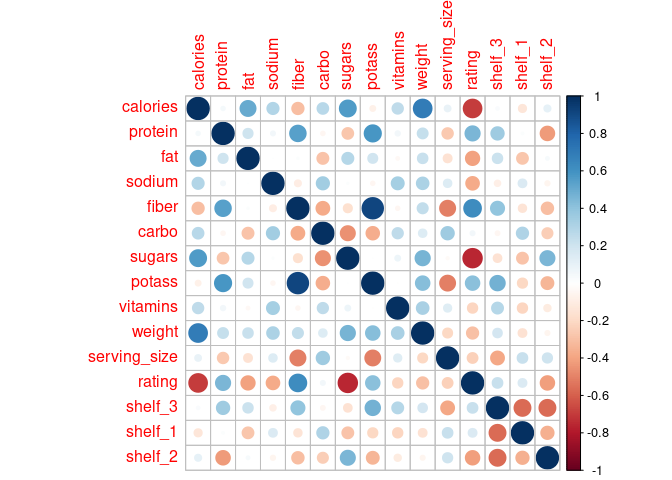

-   **Positively Correlated**
    -   Fiber and potassium have a high correlation to one another,
    -   Calorie to weight and sugar,
    -   Fiber to protein, potassium, fiber, and rating
-   **Negatively Correlated**
    -   Rating to calories and sugars

**Summary** Most of the significantly correlated variables intuitively
makes sense like ratings being positively correlated to fiber as those
tend to be considered “healthier” cereals and those with higher
calories/sugars had a lower rating. Also, interestingly it seems shelf 3
tends to have cereals with higher levels of potassium, fiber, and
protein. Shelf 2 seems to have cereals with higher sugar, low amounts of
protein, lower amounts of fiber. Depending on the height of the shelves
could make sense due to the height of a average child riding in a cart
or walking in the cereal aisle. I will have to explore below why
potassium is related to fiber and protein. I found studies on the
relationship between sodium and potassium but nothing explicitly
relating it to protein and fiber.

    cereal_norm %>%
      filter(potass > 2 & fiber > 1.5) # Bran based cereals have a highest potassium levels and also tend to have highest amounts of protein.

    ## # A tibble: 4 x 17
    ##   name  mfr   calories protein     fat sodium fiber  carbo sugars potass
    ##   <chr> <fct>    <dbl>   <dbl>   <dbl>  <dbl> <dbl>  <dbl>  <dbl>  <dbl>
    ## 1 100%… N       -1.89    1.33  -0.0129 -0.354  3.29 -2.51  -0.234   2.58
    ## 2 All-… K       -1.89    1.33  -0.0129  1.20   2.87 -2.00  -0.463   3.14
    ## 3 All-… K       -2.92    1.33  -1.01   -0.235  4.97 -1.74  -1.60    3.29
    ## 4 Post… P        0.673   0.415 -0.0129  0.481  1.61 -0.973  1.59    2.29
    ## # … with 7 more variables: vitamins <dbl>, weight <dbl>, serving_size <dbl>,
    ## #   rating <dbl>, shelf_3 <int>, shelf_1 <int>, shelf_2 <int>

Determining a value for K.
--------------------------

    # these
    fviz_nbclust(cereal_norm[, 3:17], FUN = hcut, method = "wss")

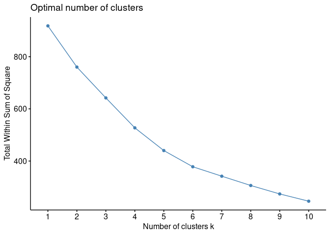

    fviz_nbclust(cereal_norm[, 3:17], FUN = hcut, method = "silhouette")

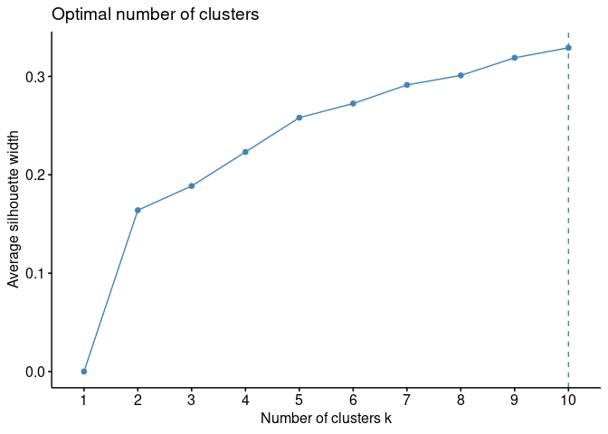

I am going to use the WSS and Silhouette methods to give me a starting
point for finding optimal k. Often times there is not a “best” approach
to always optimizing k. I will start analyzing k=6 and see how the
cereals are grouped and make adjustments if needed from there.

    # Set the rownames for the dendrograms.
    rownames(cereal_norm) <- cereal_norm$name
    # Finding the distance using euclidean method.
    d <- get_dist(cereal_norm,
                  method = "euclidean")

Why I am using Hierachical Clustering
-------------------------------------

### K-means Clustering

K-means clustering algorithm is based on the number of clusters you
choose. For example, let’s say that you want 3 clusters. K-means
randomly chooses 3 starting points each representing a cluster, then
each of those starting points chooses the closest data point based on a
distance calculation (see above code). Those two points for each cluster
forms the 3 new clusters and form a centroid (the average of the two
points). The algorithm then starts again for choosing a third point to
add to each cluster and then continues that pattern until all points are
in each of the 3 clusters.

### Hierarchical Clustering

Hierarchical Clustering can begin with the entire dataset, then splits
into two clusters, and continues splitting into smaller and smaller
clusters, until all data points are paired with another point or by
itself. The end of the hierarchical clustering is called leaves and the
partitions above the leaves are called branches. This method is called
Diversive Analysis Clustering or DIANA.

The other approach is to reverse this process by starting with the
leaves and reversing the above process until all points are a single
cluster. This method is called Agglomerative Nesting or AGNES.

### Hierarchical Clustering is better for this problem.

The best method for this problem would be Hierarchical clustering.
K-Means tends to favor more globular clusters and it only has one method
on how the clusters are formed. Hierarchical clusters have many more
methods to control how we can link the data to form the clusters. This
will be more helpful since I already am very familiar with the types of
cereals in this dataset and inspecting the different methods for
clustering in the dendrogram will allow me to choose the best way to
cluster the cereals. I am favoring more control on the clusters that are
formed.

Hierarchical Analysis of Cereals
================================

Single Linkage: The Worst Linkage
---------------------------------

    # Hierarchical clustering using cereal_norm Linkage, Single Linkage, Average Linkage, and Ward's Method. Using agnes() to obtain the AC or cluster structure strength and using hclust() to plot dendrogram.

    # Using "dendextend" to plot more dynamic dendrograms.
    library(dendextend)

    # creating a dissimilarity matrix based on euclidean distance using "complete linkage" method to create the dendrogram.
    hc <- hclust(d, method = "single")

    # Converting hclust to a dendrogram class so I can visualize it.
    dend <- as.dendrogram(hc)

    # Setting margins for the graph.
    par(mar=c(10,1,1,1))

    # Setting labels, branch and label colors, & label size. I repeat the above and below steps for the "average linkage", "complete linkage", and "ward method" for creating the dendrograms. I will not show the code as the only difference is the method is equal to the listed type of linkage.
    dend %>%
      set("labels_col",
          value = c("skyblue",
                    "firebrick",
                    "orange",
                    "grey",
                    "blue",
                    "green"
                    ),
          k = 6
          ) %>%
      set("branches_k_color",
          value = c("skyblue",
                    "firebrick",
                    "orange", "grey",
                    "blue",
                    "green"
                    ),
          k = 6
          ) %>%
      set("nodes_cex", 0.7) %>%
      set("labels_cex", .6) %>%
      plot(axes=FALSE)

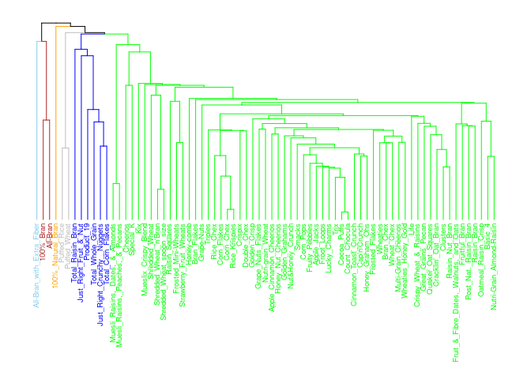

    # Creating a clustering visualization to see the groupings in 2-dimensions for clustering structure comparison.
    sub_group <-  cutree(hc, k = 6)
    fviz_cluster(list(data = cereal_norm[,3 :17], cluster = sub_group))

Cluster 2 contains about 85% of all the cereals. The cereals in that
cluster are of different types like Trix and Great Grains Pecans. This
method did not do a good job clustering the cereals to help me recommend
healthy types of cereals.

Average Linkage: Better than Single
-----------------------------------

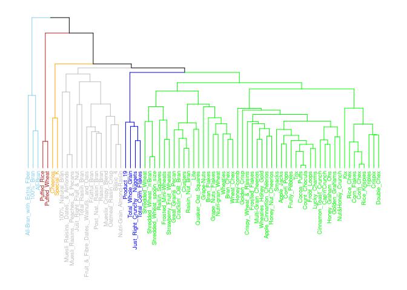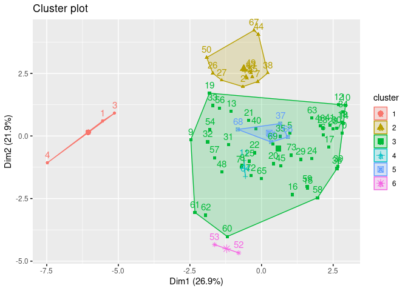

This linkage method looks very similar to single with the exception of
the larger cluster having a few small clusters inside of it. It does
seem to be an improvement over single linkage as there is more cluster
separation and clusters are more compact, comparatively.

Complete Linkage: Second Best Linkage Method
--------------------------------------------

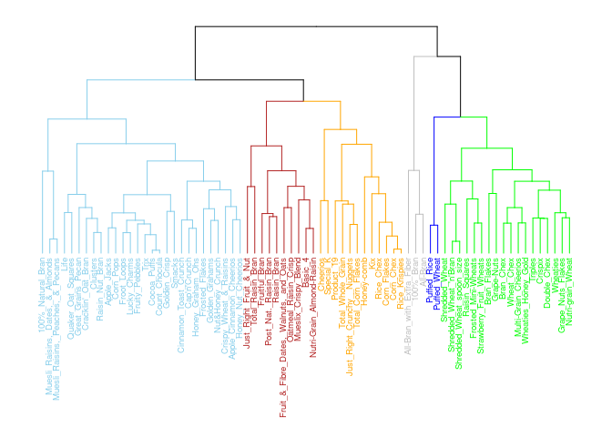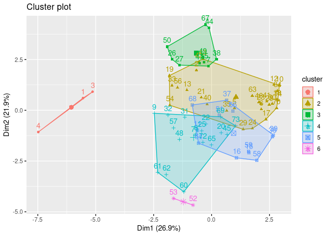

The clusters look fairly separated and fairly uniformly distributed.
Cluster 5 overlaps more significantly with 4 and 2. However, looking
closer at the dendrogram it does seem that it did a good job grouping
the cereals into like categories.

Ward’s Method: The Best Method
------------------------------

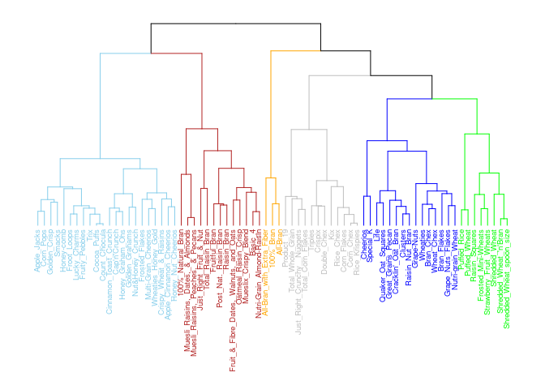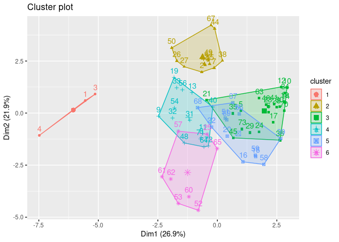

I think Ward’s is the best method for the cereal recommendations as the
clusters are more separate and compact (except cluster 3 which overlaps
5). For only having 73 cereals, I think the above dendrogram does a good
job of classifying the clusters. For example, All Bran brand cereals are
in their own cluster and on the same branch as Grape Nuts, Quaker Oat
Squares, etc… While Corn Pops is with Trix and Fruity Pebbles on it’s
own branch.

AC Confirms My Analysis
-----------------------

    # Agglomerative coefficient with Agnes to determine the strength of the cluster structure.
    m <- c("average",
           "single",
           "complete",
           "ward"
            )

    names(m) <- c("average",
                   "single",
                   "complete",
                   "ward")

    # function to compute coefficient
    ac <- function(x) {
      agnes(d,
            method = x)$ac
    }

    map_dbl(m, ac)

    ##   average    single  complete      ward
    ## 0.7775099 0.5767978 0.8426844 0.9002626

I am going with the Ward method due to the visualizations and with the
strength of the structure being the highest at .90 and due to my
analysis aligning with these results as well.

Test Partitioning: Clusters have Very Good Stability
====================================================

### Preparation for Cluster Comparison and Classification

    cereal <- cereal[complete.cases(cereal), ] # removing rows with missing values.
    cereal <- cereal[-42, -3] # removing Maypo and the Type column.
    # I did the above steps that the rows match the normalized dataset. I needed to do this so the cereals in both df match one another and so I can match the cluster number to the correct cereal.

    # attaching the cluster number of each cereal to the normalized dataset.
    cereal_norm$cluster <- as.factor(cutree(dend, k = 6))
    cereal$cluster <- as.factor(cutree(dend, k = 6))

1. Creating Partitions
----------------------

    # Split the dataset by 50% randomly using the Caret Package. I choose 50% because the dataset is small.
    test_split <- createDataPartition(cereal_norm$sugars, p = .5, list = FALSE)

    test <- cereal_norm[test_split, ]

    row.names(test) <- test$name

2. Calculating New Distance
---------------------------

    # If I used the previous one distance calculated on the larger dataset, then I would get the exact same result. I am testing to see how well the clustering algorithm will put the same cereals together in the smaller partition as the larger dataset. If the clusters are more or less the same then that will provide greater evidence that the groupings are stable.
    d2 <- get_dist(test,
                   method = "euclidean")

3. Ward’s Method on Test Datset
-------------------------------

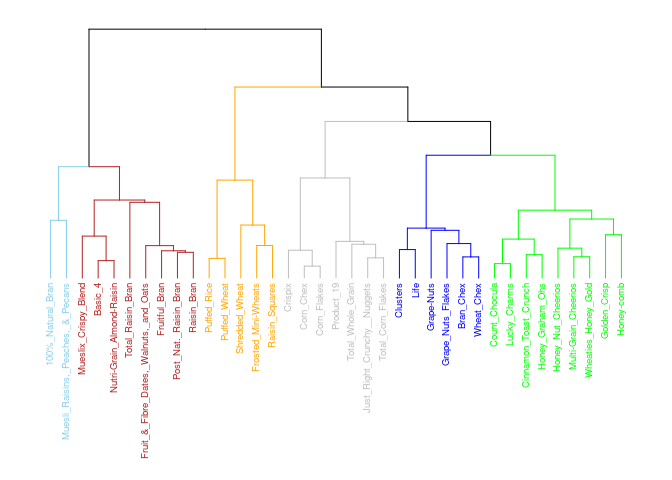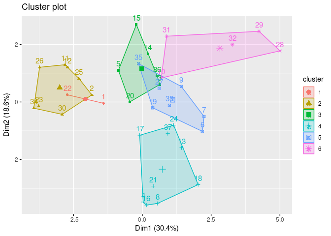

4. Cluster Stability Comparison
-------------------------------

    # Looking at the formation of the clusters of the test partition with the original dataset.
    # Found the intersection of the orginal dataset with the test partition.
    intersect_dend <- intersect_trees(dend1 = dend_test, dend2 = dend)

    # Using the dendbackback function in the "dendextend" package to map the two dendrograms back to back.
    dendbackback(
      intersect_dend[[1]],
      intersect_dend[[2]],
      sort = TRUE,
      highlight_distinct_edges = FALSE,
      common_subtrees_color_lines = TRUE,
      common_subtrees_color_branches = TRUE)

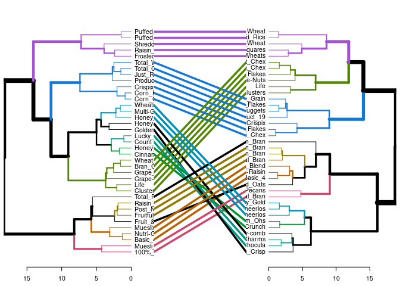

    intersect_dend_orig <- intersect_dend[[2]]

    # attaching the cluster number of the DIANA results to the normalized dataset.
    test$cluster2 <- as.factor(cutree(dend_test, k = 6))

    # attaching the cluster number of each cereal to the normalized dataset.
    cereal_norm$cluster <- as.factor(cutree(dend, k = 6))

    test %>%
      filter(cluster == cluster2) %>%
      select(name, cluster, cluster2)

    ## # A tibble: 20 x 3
    ##    name                                   cluster cluster2
    ##    <chr>                                  <fct>   <fct>   
    ##  1 Basic_4                                2       2       
    ##  2 Corn_Chex                              5       5       
    ##  3 Corn_Flakes                            5       5       
    ##  4 Crispix                                5       5       
    ##  5 Frosted_Mini-Wheats                    6       6       
    ##  6 Fruit_&_Fibre_Dates,_Walnuts,_and_Oats 2       2       
    ##  7 Fruitful_Bran                          2       2       
    ##  8 Just_Right_Crunchy__Nuggets            5       5       
    ##  9 Mueslix_Crispy_Blend                   2       2       
    ## 10 Nutri-Grain_Almond-Raisin              2       2       
    ## 11 Post_Nat._Raisin_Bran                  2       2       
    ## 12 Product_19                             5       5       
    ## 13 Puffed_Rice                            6       6       
    ## 14 Puffed_Wheat                           6       6       
    ## 15 Raisin_Bran                            2       2       
    ## 16 Raisin_Squares                         6       6       
    ## 17 Shredded_Wheat                         6       6       
    ## 18 Total_Corn_Flakes                      5       5       
    ## 19 Total_Raisin_Bran                      2       2       
    ## 20 Total_Whole_Grain                      5       5

### Very Good Cluster Stability

20 of the 37 or 49% of the cereals were classified to the **same cluster
number** as the original dataset. However this is misleading, the
dendrogram visualization above shows that only 4 cereals were not
grouped in the same cluster with the same cereals. This means that
actually, 32 out of the 36 cereals were clustered the same as the
original dataset. I would say that is pretty good!

Test Partitioning Trial \#2
---------------------------

I am repeating the same process as above so I choose not to show the
output since it is simply repeated.

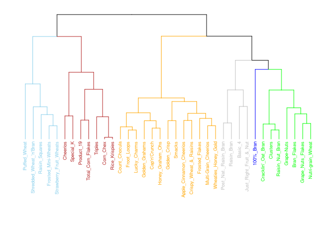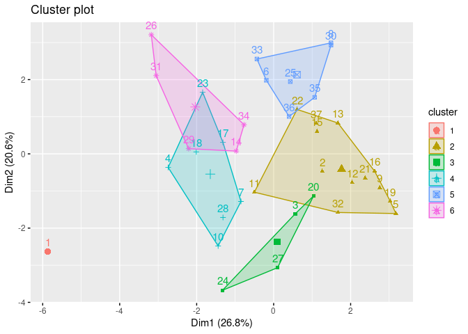

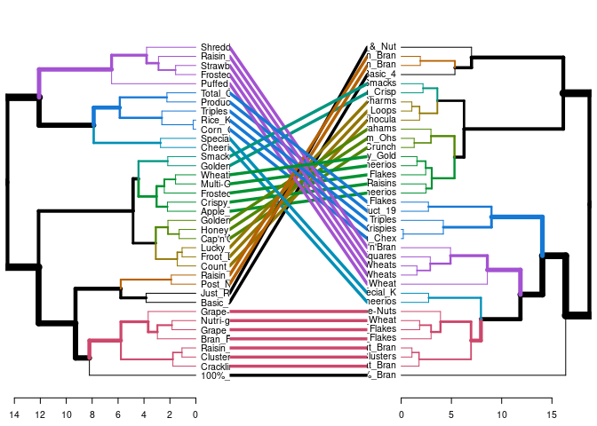

    ## # A tibble: 18 x 3
    ##    name                    cluster cluster2
    ##    <chr>                   <fct>   <fct>   
    ##  1 100%_Bran               1       1       
    ##  2 Bran_Flakes             4       4       
    ##  3 Clusters                4       4       
    ##  4 Corn_Chex               5       5       
    ##  5 Cracklin'_Oat_Bran      4       4       
    ##  6 Frosted_Mini-Wheats     6       6       
    ##  7 Grape_Nuts_Flakes       4       4       
    ##  8 Grape-Nuts              4       4       
    ##  9 Nutri-grain_Wheat       4       4       
    ## 10 Product_19              5       5       
    ## 11 Puffed_Wheat            6       6       
    ## 12 Raisin_Nut_Bran         4       4       
    ## 13 Raisin_Squares          6       6       
    ## 14 Rice_Krispies           5       5       
    ## 15 Shredded_Wheat_'n'Bran  6       6       
    ## 16 Strawberry_Fruit_Wheats 6       6       
    ## 17 Total_Corn_Flakes       5       5       
    ## 18 Triples                 5       5

18 of the 37 or 49% of the cereals were classified to the **same cluster
number** as the original dataset. However this is misleading, the
dendrogram visualization above shows that only 3 cereals were not
grouped in the same cluster with the same cereals. This means that
actually, 33 out of the 36 cereals were clustered the same as the
original dataset. Again that is really good!

AGNES meets DIANA
-----------------

One last test of cluster stability is using Diversive Hierarchical
Clustering and see how it compares to Agglomerative Hierarchical
Clustering. Again, I am repeating the same process as above so I will
only show the output.

DIANA Comparison
----------------

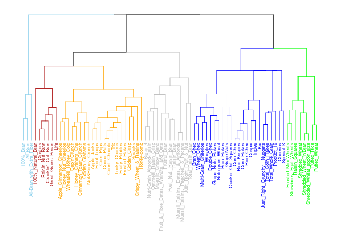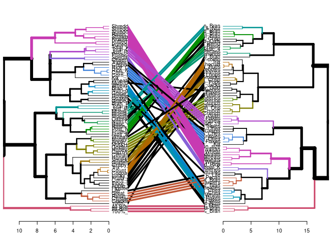

    ## # A tibble: 45 x 3
    ##    name                      cluster diana
    ##    <chr>                     <fct>   <fct>
    ##  1 100%_Bran                 1       1    
    ##  2 100%_Natural_Bran         2       2    
    ##  3 All-Bran                  1       1    
    ##  4 All-Bran_with_Extra_Fiber 1       1    
    ##  5 Apple_Cinnamon_Cheerios   3       3    
    ##  6 Apple_Jacks               3       3    
    ##  7 Cap'n'Crunch              3       3    
    ##  8 Cinnamon_Toast_Crunch     3       3    
    ##  9 Cocoa_Puffs               3       3    
    ## 10 Corn_Chex                 5       5    
    ## # … with 35 more rows

### Very Good Cluster Stability, Again!

Performed the diana hierarchical clustering and compared it with the
agnes hierarchical clustering to see if the clusters are similar for
both methods which also gives evidence that the clusters are stable.
Looking above you can see 45 of the 73 or about 62% cereals were grouped
the same as agnes. I believe this gives further evidence of a decent
clustering stability as two different clustering algorithms formed
mostly the same cluster groupings.

Clustering Stability Conclusion
-------------------------------

I believe that I can high confidence that the clusters are stable based
on the two trial partition results being very high. Also, DIANA having
62% cluster similarity, I believe gives even greater confidence due to
it being a different method for hierarchical clustering but still having
the majority of clusters groups the same as our original clustering from
the Ward’s Method using Agnes.

Healthy Cereal Recommendations
==============================

Average Clusters for Comparison
-------------------------------

    # Putting cereals into their clusters and then finding the average of each cluster so I can better compare the clusters to one another and determine what kind of cereals are in each cluster using the normalized dataset so that all the variables are within the same range.
    cereal_norm %>%
      filter(cluster == 1) %>%
      summarise_all(mean) -> cl1_ave

    cereal_norm %>%
      filter(cluster == 2) %>%
      summarise_all(mean) -> cl2_ave

    cereal_norm %>%
      filter(cluster == 3) %>%
      summarise_all(mean) -> cl3_ave

    cereal_norm %>%
      filter(cluster == 4) %>%
      summarise_all(mean) -> cl4_ave

    cereal_norm %>%
      filter(cluster == 5) %>%
      summarise_all(mean) -> cl5_ave

    cereal_norm %>%
      filter(cluster == 6) %>%
      summarise_all(mean) -> cl6_ave

    cluster_mean <- as.data.frame(rbind(cl1_ave, cl2_ave, cl3_ave, cl4_ave, cl5_ave, cl6_ave))

    cluster_mean %>%
      relocate(shelf_1, shelf_2, shelf_3, sugars, fiber, potass) -> cluster_mean
    cluster_mean <- cluster_mean[ ,c(-7, -8, -18)]

    # Using "reshape2" package to rotate the average cluster dataset to three columns "name", "variable", and "value" so that I can then plot this dataset onto graphs to better visualize the comparisons of each cluster.
    library(reshape2)
    cluster_mean <- melt(cluster_mean)
    cluster_mean$cluster <- c(1,2,3,4,5,6)

    # Based on the different recommendations for healthy amounts of fiber, sodium, and sugar. I am adding those recommendations to the original cereal dataset so I can use them in my recommendations and for comparisons of clusters.

    # Healthy sugar level variable.
    cereal %>%
      mutate(sugar_lvl = serving_size/4*.25) -> cereal

    cereal$healthy_sugar_lvl <- ifelse(cereal$sugars <= cereal$sugar_lvl, yes = 1, no = 0)

    # Healthy fiber levels variable.
    cereal$healthy_fiber_lvl <- ifelse(cereal$fiber >= 3, yes = 1, no = 0)

    # Healthy and high sodium levels variable.
    cereal$healthy_sodium_lvl <- ifelse(cereal$sodium/cereal$serving_size <= .05, yes = 1, no = 0)

    cereal$high_sodium_lvl <- ifelse(cereal$sodium/cereal$serving_size >= .2, yes = 1, no = 0)

Cluster Comparisons
-------------------

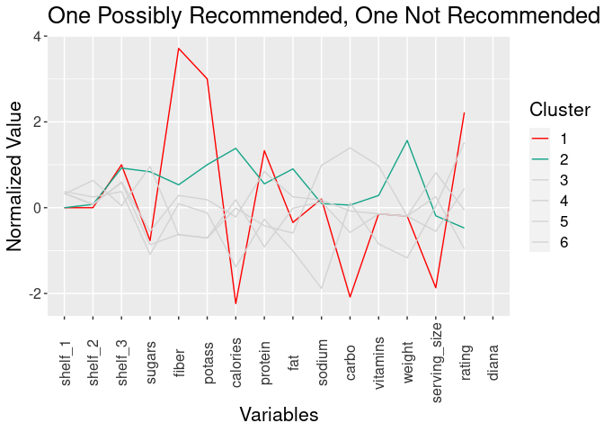

-   **Cluster 1: Could be Recommended
    Cereals** 
-   **located\_ on shelf 3**   +
    **Attributes:**
    -   lower sugar
    -   highest fiber
    -   lowest calories
    -   lowest carbs
    -   highest protein
    -   highest rating 
-   **Cluster 2: Not Recommended
    Cereals** 
-   **located on shelf 3**   +
    **Attributes:**
    -   higher calories
    -   lower rating   

<!-- -->

    ## # A tibble: 3 x 5
    ##   name                cluster healthy_sugar_lvl healthy_fiber_l… high_sodium_lvl
    ##   <chr>               <fct>               <dbl>            <dbl>           <dbl>
    ## 1 100%_Bran           1                       0                1               1
    ## 2 All-Bran            1                       0                1               1
    ## 3 All-Bran_with_Extr… 1                       1                1               1

All of **cluster 1** cereals all have high sodium levels. Could be on
the recommendation list due to the other benefits like protein and
fiber. However, kids probably would not typically choose these cereals.

    ## # A tibble: 13 x 5
    ##    name                cluster healthy_sugar_l… healthy_fiber_l… high_sodium_lvl
    ##    <chr>               <fct>              <dbl>            <dbl>           <dbl>
    ##  1 100%_Natural_Bran   2                      1                0               0
    ##  2 Basic_4             2                      1                0               1
    ##  3 Fruit_&_Fibre_Date… 2                      0                1               1
    ##  4 Fruitful_Bran       2                      0                1               1
    ##  5 Just_Right_Fruit_&… 2                      1                0               1
    ##  6 Muesli_Raisins,_Da… 2                      1                1               1
    ##  7 Muesli_Raisins,_Pe… 2                      1                1               1
    ##  8 Mueslix_Crispy_Ble… 2                      0                1               1
    ##  9 Nutri-Grain_Almond… 2                      1                1               1
    ## 10 Oatmeal_Raisin_Cri… 2                      0                0               1
    ## 11 Post_Nat._Raisin_B… 2                      0                1               1
    ## 12 Raisin_Bran         2                      0                1               1
    ## 13 Total_Raisin_Bran   2                      0                1               1

All except one cereal of **cluster 2** cereals have high sodium and 7
out of 13 cereals have high sugar levels. Only 9 of the cereals have
good fiber as well.

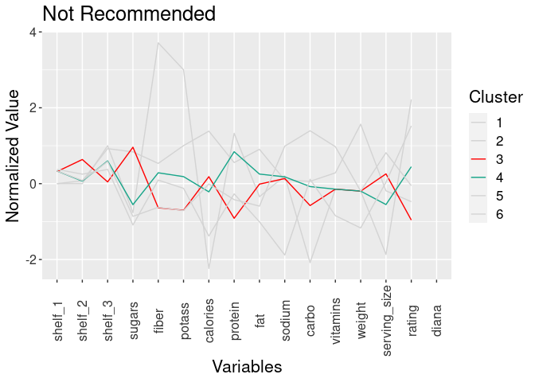

-   **Cluster 3: Not Recommended
    Cereals** 
    -   **located on shelves 1 & 2** 
         + **Attributes:**
        -   highest sugar
        -   low fiber
        -   lowest protein
        -   lower carbs
        -   lowest rating 
-   **Cluster 4: Not Recommended
    Cereal** 
    -   **located on shelves 1 & 3** 
        + **Attributes:**
        -   lower sugar
        -   lowest fiber
        -   higher protein
        -   higher rating

<!-- -->

    cereal %>%
      filter(cluster == 3) %>%
      select(name, cluster,  healthy_sugar_lvl, healthy_fiber_lvl, high_sodium_lvl)

    ## # A tibble: 22 x 5
    ##    name               cluster healthy_sugar_lvl healthy_fiber_l… high_sodium_lvl
    ##    <chr>              <fct>               <dbl>            <dbl>           <dbl>
    ##  1 Apple_Cinnamon_Ch… 3                       0                0               1
    ##  2 Apple_Jacks        3                       0                0               1
    ##  3 Cap'n'Crunch       3                       0                0               1
    ##  4 Cinnamon_Toast_Cr… 3                       1                0               1
    ##  5 Cocoa_Puffs        3                       0                0               1
    ##  6 Corn_Pops          3                       1                0               1
    ##  7 Count_Chocula      3                       0                0               1
    ##  8 Crispy_Wheat_&_Ra… 3                       0                0               1
    ##  9 Froot_Loops        3                       0                0               1
    ## 10 Frosted_Flakes     3                       0                0               1
    ## # … with 12 more rows

13 of the cereals in **cluster 3** have unhealthy sugar levels and none
of them have healthy fiber or sodium levels. Kids should not consume
these.

    cereal %>%
      filter(cluster == 4) %>%
      select(name, cluster, healthy_sugar_lvl, healthy_fiber_lvl, high_sodium_lvl)

    ## # A tibble: 15 x 5
    ##    name               cluster healthy_sugar_lvl healthy_fiber_l… high_sodium_lvl
    ##    <chr>              <fct>               <dbl>            <dbl>           <dbl>
    ##  1 Bran_Chex          4                       1                1               1
    ##  2 Bran_Flakes        4                       1                1               1
    ##  3 Cheerios           4                       1                0               1
    ##  4 Clusters           4                       0                0               1
    ##  5 Cracklin'_Oat_Bran 4                       0                1               1
    ##  6 Grape_Nuts_Flakes  4                       1                1               1
    ##  7 Grape-Nuts         4                       1                1               1
    ##  8 Great_Grains_Pecan 4                       1                1               1
    ##  9 Life               4                       1                0               1
    ## 10 Nutri-grain_Wheat  4                       1                1               1
    ## 11 Quaker_Oat_Squares 4                       1                0               1
    ## 12 Raisin_Nut_Bran    4                       0                0               1
    ## 13 Special_K          4                       1                0               1
    ## 14 Wheat_Chex         4                       1                1               1
    ## 15 Wheaties           4                       1                1               1

13 of the cereals in **cluster 4** have healthy sugar levels. 14 cereals
**do not** have healthy fiber levels and they all have high sodium. The
only factor that cluster 3 has going for it is the sugar levels but I
don’t believe that is enough to recommend it as the other “unhealthy”
factors outweigh that benefit.

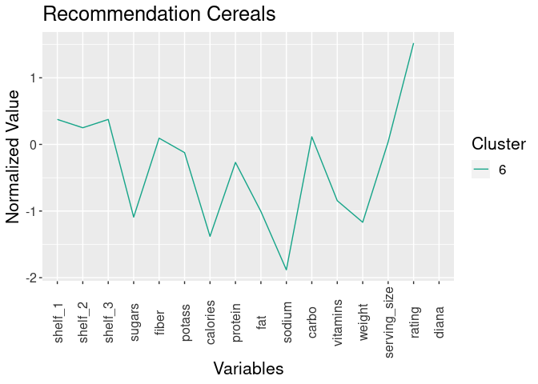

-   **Cluster 5: Not Recommended
    Cereals** 
    -   **located on shelves 1 & 3** 
        + **Attributes:**
        -   lower sugars
        -   lower fiber
        -   high sodium
        -   high carbs
        -   high vitamins
-   **Cluster 6: Recommended
    Cereals** 
    -   **located on shelves 1 & 3** 
         + **Attributes:**
        -   loweest sugar
        -   lower calories
        -   lowest sodium
        -   high rating

<!-- -->

    cereal %>%
      filter(cluster == 5) %>%
      select(name, cluster, healthy_sugar_lvl, healthy_fiber_lvl, high_sodium_lvl)

    ## # A tibble: 12 x 5
    ##    name               cluster healthy_sugar_lvl healthy_fiber_l… high_sodium_lvl
    ##    <chr>              <fct>               <dbl>            <dbl>           <dbl>
    ##  1 Corn_Chex          5                       1                0               1
    ##  2 Corn_Flakes        5                       1                0               1
    ##  3 Crispix            5                       1                0               1
    ##  4 Double_Chex        5                       1                0               1
    ##  5 Just_Right_Crunch… 5                       1                0               1
    ##  6 Kix                5                       1                0               1
    ##  7 Product_19         5                       1                0               1
    ##  8 Rice_Chex          5                       1                0               1
    ##  9 Rice_Krispies      5                       1                0               1
    ## 10 Total_Corn_Flakes  5                       1                0               1
    ## 11 Total_Whole_Grain  5                       1                1               1
    ## 12 Triples            5                       1                0               1

All of **cluster 5** cereals have healthy sugar levels but have high
sodium and all but one do not have enough fiber. Although they do have
high vitamins which could be a benefit but hard to determine from this
dataset. Overall I don’t believe that the healthy sugar levels and high
vitamins are enough to recommend as the sodium levels are the highest
and the fiber is lower compared to the other clusters.

    cereal %>%
      filter(cluster == 6) %>%
      select(name, cluster, healthy_sugar_lvl, healthy_sodium_lvl, healthy_fiber_lvl)

    ## # A tibble: 8 x 5
    ##   name              cluster healthy_sugar_lvl healthy_sodium_l… healthy_fiber_l…
    ##   <chr>             <fct>               <dbl>             <dbl>            <dbl>
    ## 1 Frosted_Mini-Whe… 6                       1                 1                1
    ## 2 Puffed_Rice       6                       1                 1                0
    ## 3 Puffed_Wheat      6                       1                 1                0
    ## 4 Raisin_Squares    6                       1                 1                0
    ## 5 Shredded_Wheat    6                       1                 1                1
    ## 6 Shredded_Wheat_'… 6                       1                 1                1
    ## 7 Shredded_Wheat_s… 6                       1                 1                1
    ## 8 Strawberry_Fruit… 6                       1                 0                1

All of **cluster 6** cereals have healthy sugar levels, 7 of the cereals
have healthy sodium levels, and 5 have healthy fiber levels. Overall,
these are cereals are better for kids than the other cereals. Kids also
would eat these cereals. It also has a variety of cereals for kids to
choose from and some of them are surprising like frosted mini-wheats…who
would have guessed?!

Cereal Recommendation
---------------------

I recommend **cluster 6 cereals**\* for my children based on the reasons
listed above. However, if my kids refused those cereals then Cluster 4
would be my second recommendation due to the amount of cereals with
healthy sugar and fiber levels. Although their blood pressure might
suffer due to the sodium…parenting is not easy… 
